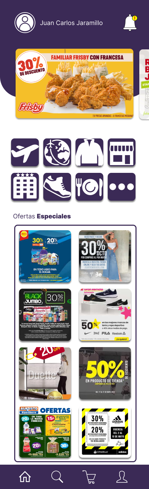

# Diseño de interfaz de usuario

La interfaz de usuario de la aplicación CuponApp esta inspirada en la interfaz de usuario de
aplicaciones similares 

El diseño completoe esta disponible
en [Figma](https://www.figma.com/file/7BKBuvQa9VZ8Em5tFnTvS8/Untitled?type=design&node-id=0%3A1&mode=design&t=5vcoYL5zvvXyPN7b-1](https://www.figma.com/file/7BKBuvQa9VZ8Em5tFnTvS8/Untitled?type=design&node-id=0%3A1&mode=design&t=5vcoYL5zvvXyPN7b-1))
. 
Los colores a usar estan basados en una combinación de colores morado para llamar la atencion. A continuación se
presentan las principales pantallas:

1. Inicio de sesion:

   podra iniciar sesion por medio de formulario, google o facebook 

   

2. lista general de los descuentos:

   Al ingresar, el usuario verá la lista de descuentos mas calientes del momento.

   

3. registro:

  podra registrarse por medio de google, facebook y formulario

   

4. informacion detallada de producto:
   
   podra ver informacion detallada sobre el descuento del producto
   
   
   
5. generar descuento:

   se genera un descuento por qr
   
   
   
6.buscador:

  podra filtrar o buscar por productos o marca
  
  
  
7. carrito:
   
   podra comprar membresias
   
   

8. perfil:
   
   podra editar su perfil, ver membresia y ver su historial
   
   

9.cerrar sesion:

   podra cerrar sesion para mejorar su privacidad
   
   
